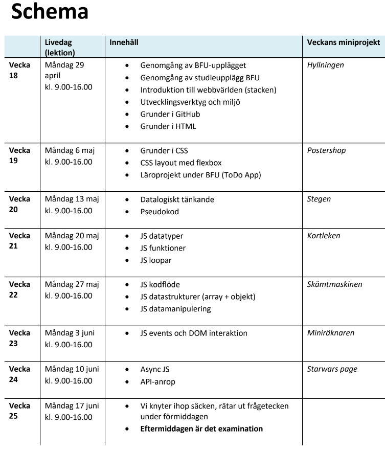

# 2024-06-03
Lektion vecka 6, JavaScript i webbläsaren

## Material
+ [Övningar](exercises.md)
+ Presentation: [07 DOM](https://docs.google.com/presentation/d/1J4sKyun1Zt_XP_lneAWP1dmhGue4YCqqP6T8gySJ5DM/edit?usp=sharing)

Veckoprojekt
+ projektet - kommer
+ inlämning - kommer

Inspelning
+ Länk kommer

## Resurser

[Skriv JavaScript online](https://replit.com/) | replit.com

[Skriv JavaScript online](https://codepen.io/) | codepen.io, smidigt för enkla webbsidor

[The Modern JavaScript Tutorial](https://javascript.info/) - bra referens till JS

## Schema

