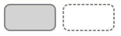
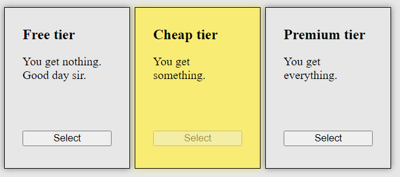
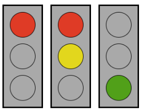

# Övningar: JavaScript i webbläsaren

+ Syftet med övningarna är att träna på att skriva kod, snarare än att hitta exakt rätt lösning. Försök att arbeta med så många övningar som möjligt.
+ Det går att lösa de flesta uppgifter på flera sätt. Gå gärna tillbaka till tidigare uppgifter och se om du kan lösa dem på något annat sätt.
+ Innan du kör fast: diskutera din kod med klasskamrater på Discord, eller be Aizo förklara / ge ledtrådar.

Ett bra sätt att lära sig programmera är att:
1. försöka själv först
1. läsa någon annans kod
1. diskutera kod med någon annan


Skriv din kod i Visual Studio Code eller Replit.

---

1 Läsförståelse. Vad gör följande kod?

```html
<!-- HTML -->
<main>
    <section class="container">
        <h1> DOM-manipulation med JavaScript </h1>
        <p class="output"></p>
        <button id="mystery-button"> Mystery </button>
        <ul class="mystery-list"></ul>
    </section>
</main>
```
```css
/* CSS */
.hot { background-color: hotpink; }
```
```js
// JavaScript
const output = document.querySelector('.output')
output.innerText = ''
output.innerText += 'Hello    world'
output.classList.toggle('hot')
```

---

2 Vi bygger vidare på koden från uppgift 1 med mera JavaScript. Vad gör koden?
```js
const elem = document.querySelector('.container > :first')
output.innerHTML += '<br>' + elem.innerText
```

---

3 Varför fungerar inte följande kod? Vad betyder felmeddelandet du får?
```js
const elem2 = document.querySelector('output')
elem2.innerText += 'Yolo'
```

---

4 Vi bygger vidare på koden från uppgift 1. Vad gör koden?
```js
const btn = document.querySelector('#mystery-button')
btn.addEventListener('click', f)
function f() {
    output.innerText = "It's a mystery"
}
```

5 Vi bygger vidare på koden från uppgift 1. Vad gör koden?
```js
btn.addEventListener('click', g)
const list = document.querySelector('.mystery-list')

function g() {
    let x = document.createElement('li')
    x.innerText = '?'
    list.append(x)
}
```

---
6 Skapa ett nytt webbprojekt i VS Code - hello world:
1. Börja med att skapa en mapp och öppna den. (File -> Open Folder)
1. Skapa filerna `index.html`, `style.css` och `script.js`
1. Bygg en webbsida som innehåller ett p-element med en CSS-klass: `<p class="output"></p>`
1. Styla p-elementet. Använd border, padding, margin, color och background-color.
1. Skapa en variabel för elementet i din JS-fil. Använd querySelector.
1. Ändra textinnehållet i elementet så att det står `Hello world!`. Använd `.innerText`.

---

10 Gör en `<button>` med texten "Byt färg", som växlar bakgrundsfärg när man klickar på den. Exempel med grå och vit bakgrund:



*Tips: använd querySelector, addEventListener, classList och CSS-klasser.*

11 Gör en `<button>` som togglar "Byt färg" knappens synlighet. Dvs när man klickar på nya knappen ska "Byt färg" knappen bli osynlig. Men när man klickar igen ska "Byt färg" knappen synas igen.

[Tips: *opacity* eller *visibility*.](https://www.w3schools.com/cssref/pr_class_visibility.php) Använd en variabel för att komma ihåg om knappen ska bli synlig eller osynlig.

```html
<button> Göm förra knappen </button>
```

---
12 Lägg ut två `<input type="text" />` element på sidan, med tillhörande `<label>`. Syftet med textfälten är att man ska skriva in för- och efternamn. Varje gång användaren skriver i något av fälten, ska hela namnet skrivas ut. Till exempel kan det stå "Välkommen Sven Svensson.".


```html
<label> Förnamn </label>
<input type="text" />
<p> Välkommen [förnamn] [efternamn]. </p>
```

Tips: input-fält har händelserna `keyUp` och `change`. Prova båda och se om du kan förstå vad som är skillnaden mellan dem.

---
13 Bygg en sida där man kan välja en prenumerationsform: gratis, billig eller dyr. När man klickar på en av "Select" knapparna ska motsvarande block färgas, för att åskådliggöra användarens val.



---

14 Bygg en sida med ett trafikljus. När man klickar på en knapp ska nästa lampa i serien tändas: rött → gult → grönt.

När du löst det, bygg om koden så att det blir ett realistiskt trafikljus: rött → rött och gult samtidigt → grönt → gult → rött ljus.

Exempel, tre trafikljus som visar olika signaler.



*Tips: du kan bygga ett trafikljus lätt med flexbox. Lägg ut tre div-element vertikalt. Använd border-radius för att göra rundade hörn. Använd CSS-klasser för att styra färgerna.*

---

20 Skapa en JavaScript-lista med namnen på 10 frukter. Gör en knapp, som när man klickar på den renderar alla frukterna som text inuti HTML-element. (Rendera betyder att lägga till i HTML-element, så att det blir synligt på webbsidan.)

21 Gör en knapp med texten "Ät en frukt". När man klickar på den ska ett meddelande visas på webbsidan, om hur många man ätit: `Du har ätit 1 frukt`. Nästa gång man klickar ska det stå: `Du har ätit 2 frukter`. Man ska kunna klicka hur många gånger som helst.

22 Lägg till ett input-fält där man kan skriva in namnet på en frukt, och en knapp med texten "Lägg till frukt". När man klickar på den ska fruktens namn visas på samma ställe som de 10 från uppgift 10.

23 Gör så att varje frukt dessutom har en knapp. När man klickar på den ska det stå vilken frukt man klickade på. Exempel:
```html
<li> Äpple <button> Välj frukt </button> </li>
```
Klick!
```html
<p class="output"> Du valde äpple! </p>
```

24 Lägg till en knapp för varje frukt med texten "Ta bort". När man klickar på den, ska frukten tas bort från listan.

---

30 Gör en enkel "todo" lista. Det är en dynamisk lista med uppgifter, som användare kan markera som avklarade eller inte.

1. Formulärelement för att lägga till en ny todo: ett textfält.

1. Varje todo ska du spara som ett objekt i en lista. Varje todo-objekt ska ha egenskaperna `id`, `done: false` och `text: ''`.

1. Gör en funktion som kan rendera listan med todo-objekt. Anropa den varje gång listan ändras. (Användaren lägger till en ny todo.) Observera att när ett todo-objekt renderas behöver man både kunna se texten och en `<input type="checkbox" />` där egenskapen `checked` bestäms av `done`.

1. Gör så att man kan klicka på checkboxarna för att ändra status på objekten i listan.

1. Lägg till möjlighet att ta bort och att ändra en todo item.

---

40 Gör en adressbok. Från början är adressboken tom. Användaren ska kunna klicka på en knapp för att lägga till en ny kontakt. Kontakter ska ha namn och e-postadress. Appen behöver skapa flera element, när man lägger till en ny kontakt, för att det ska se snyggt ut.

Alla kontakter ska sparas som en lista i en variabel. Gör en separat knapp som man kan klicka på för att tömma HTML-listan. Sedan ska din kod skapa element för alla objekt i listan. Knappen ska ha texten "Re-render".
```html
<button> Clear all </button>
<button Re-render </button>
```

Lägg till knappar med texten "Remove" på varje kontakt. Klickar man på dem så ska kontakten tas bort både från HTML och från variabeln.

Lägg till knappar med texten "Edit" på varje kontakt. Klickar man på dem så ska det dyka upp input-fält i kontaktens container. Man ska kunna ändra de sparade värdena på namn och e-post genom att skriva i fälten.

(Svår) Gör så att man kan ändra ordningen på elementen i listan och i HTML. Tips: du behöver lägga till ett id till objekten, samt funktionen Array.findIndex.

Lägg till ett sökfält. När man skrivit i fältet, ska bara de kontakter som matchar söksträngen visas i listan. Tänk på att man kan söka både på namn och e-postadress. Tips: Arrayfunktionen [filter](https://developer.mozilla.org/en-US/docs/Web/JavaScript/Reference/Global_Objects/Array/filter).

---
